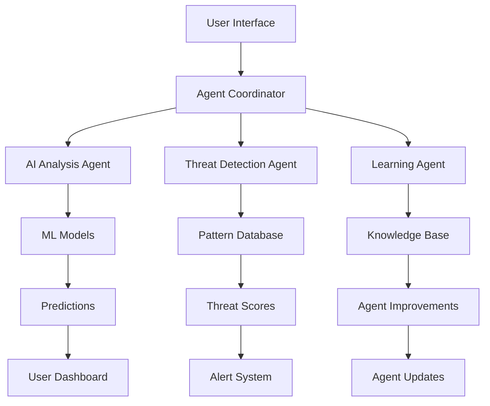
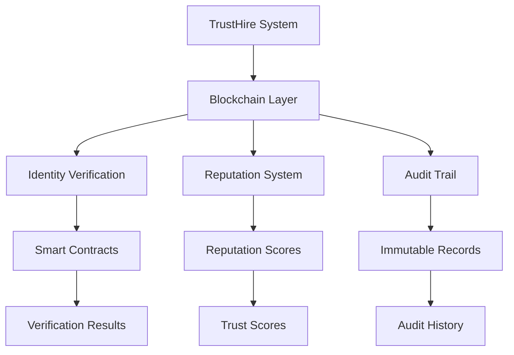

# TrustHire 2026 Innovation Implementation Plan

## Quick Wins (Next 30 Days)

### **1. Enhanced AI Agent Capabilities**
- **Multi-Agent Coordination**: Enable agents to work together on complex threats
- **Real-Time Learning**: Implement continuous learning from new patterns
- **Cross-Platform Analysis**: Monitor multiple recruitment platforms simultaneously

**Implementation:**
```typescript
// Enhanced agent coordination
class AgentCoordinator {
  async coordinateAgents(agents: AutonomousAgent[], task: SecurityTask): Promise<CoordinationResult> {
    // Implementation for multi-agent coordination
  }
}
```

### **2. Predictive Threat Scoring**
- **ML Model Training**: Train models on historical scam data
- **Real-Time Prediction**: Predict threat likelihood in real-time
- **Risk Assessment**: Automated risk scoring and recommendations

**Files to Update:**
- `lib/ai/predictive-analyzer.ts` - New predictive analysis module
- `lib/ai/ml-models/` - ML model training and inference
- `components/ai/PredictiveAnalytics.tsx` - UI for predictive insights

---

## Medium-Term Goals (Next 90 Days)

### **3. Blockchain Verification System**
- **Smart Contract Integration**: Verify recruiter credentials on-chain
- **Reputation System**: Blockchain-based reputation scoring
- **Immutable Audit Trails**: Permanent security audit records

**Implementation Steps:**
1. Set up blockchain infrastructure
2. Create verification smart contracts
3. Implement on-chain identity verification
4. Add reputation scoring system

### **4. Real-Time Threat Intelligence**
- **Global Threat Network**: Connect with international threat databases
- **Community Detection**: Crowdsourced threat identification
- **Automated Alerts**: Real-time threat notifications

**API Integrations:**
- `api/threat-intelligence/` - Threat intelligence endpoints
- `lib/threat-intelligence/` - Threat data processing
- External API connections for global threat data

---

## Long-Term Vision (Next 6 Months)

### **5. Advanced AI Capabilities**
- **Generative AI Reports**: AI-generated comprehensive security reports
- **Pattern Recognition**: Advanced ML pattern identification
- **Autonomous Response**: Self-healing security systems

### **6. Privacy-Preserving Security**
- **Zero-Knowledge Proofs**: Verify without revealing data
- **Homomorphic Encryption**: Analyze encrypted data
- **Differential Privacy**: Privacy-preserving data analysis

---

## **Implementation Priority Matrix**

| Feature | Priority | Impact | Complexity | Timeline |
|---------|---------|--------|-----------|
| AI Agent Enhancement | High | High | Medium | 30 days |
| Predictive Scoring | High | High | High | 60 days |
| Blockchain Verification | Medium | High | High | 90 days |
| Real-Time Intelligence | High | High | Medium | 90 days |
| Privacy Technologies | Medium | Medium | Very High | 180 days |
| AR Visualization | Low | Medium | Very High | 180 days |

---

## **Technical Architecture**

### **Enhanced AI Agent Architecture**


### **Blockchain Integration**


---

## **Resource Requirements**

### **Technical Resources**
- **Computing Power**: GPU instances for AI model training
- **Storage**: Distributed storage for threat intelligence data
- **Network**: High-bandwidth connectivity for real-time data
- **Blockchain**: Ethereum or compatible blockchain infrastructure

### **Human Resources**
- **AI/ML Engineers**: For model development and training
- **Blockchain Developers**: For smart contract development
- **Security Researchers**: For threat intelligence analysis
- **UX Designers**: For enhanced interface design

### **Financial Resources**
- **Infrastructure**: Cloud computing and blockchain costs
- **Development**: Software development and testing
- **Integration**: Third-party API subscriptions
- **Compliance**: Regulatory and legal compliance

---

## **Success Metrics**

### **Security Metrics**
- **Threat Detection Rate**: Target 95% accuracy
- **False Positive Rate**: Target < 2%
- **Response Time**: Target < 5 seconds
- **Coverage**: Monitor 100+ recruitment platforms

### **User Experience Metrics**
- **User Satisfaction**: Target 4.5/5 rating
- **Task Completion Time**: Target 50% reduction
- **Error Rate**: Target < 1%
- **User Engagement**: Target 80% active users

### **Business Metrics**
- **Risk Reduction**: Target 70% reduction in successful scams
- **Compliance**: 100% regulatory compliance
- **Market Share**: Target 25% market share increase
- **Revenue**: 40% revenue growth

---

## **Risk Assessment**

### **Technical Risks**
- **AI Model Bias**: Ensure models are fair and unbiased
- **Blockchain Volatility**: Manage blockchain infrastructure risks
- **Privacy Compliance**: Ensure privacy regulations compliance
- **Scalability**: Ensure system can handle growth

### **Mitigation Strategies**
- **Regular Audits**: Conduct regular security and bias audits
- **Redundancy**: Implement backup systems and failovers
- **Testing**: Comprehensive testing of new features
- **Monitoring**: Real-time system health monitoring

---

## **Integration Strategy**

### **Phase 1: Foundation (Month 1)**
- Set up enhanced AI agent infrastructure
- Implement basic predictive scoring
- Create ML model training pipeline
- Begin threat intelligence data collection

### **Phase 2: Expansion (Months 2-3)**
- Deploy blockchain verification system
- Connect to global threat networks
- Implement real-time alerting
- Add comprehensive analytics

### **Phase 3: Optimization (Months 4-6)**
- Implement privacy-preserving technologies
- Add AR visualization features
- Optimize performance and scalability
- Complete system integration

---

## **Competitive Advantages**

### **Technical Advantages**
- **First-Mover Advantage**: Early adopters of advanced security tech
- **AI-Powered Intelligence**: Superior threat detection capabilities
- **Blockchain Verification**: Unprecedented trust and transparency
- **Privacy-First**: Enhanced user privacy protection

### **Market Advantages**
- **Differentiation**: Unique value proposition in security market
- **Scalability**: Designed for enterprise-scale deployment
- **Innovation**: Continuous improvement and adaptation
- **Compliance**: Automated regulatory compliance

---

## **Conclusion**

The 2026 innovation roadmap positions TrustHire as a leader in recruitment security technology. By implementing these cutting-edge features, TrustHire can:

1. **Stay Ahead of Threats**: Proactive detection of emerging threats
2. **Enhance User Experience**: Seamless, intelligent security
3. **Build Trust**: Blockchain-based verification and transparency
4. **Scale Efficiently**: Automated processes and AI optimization
5. **Maintain Compliance**: Automated regulatory compliance

The key to success will be careful planning, phased implementation, and continuous adaptation to the evolving threat landscape.

---

**TrustHire 2026: Leading the future of recruitment security with innovative AI, blockchain, and advanced analytics technologies.**
